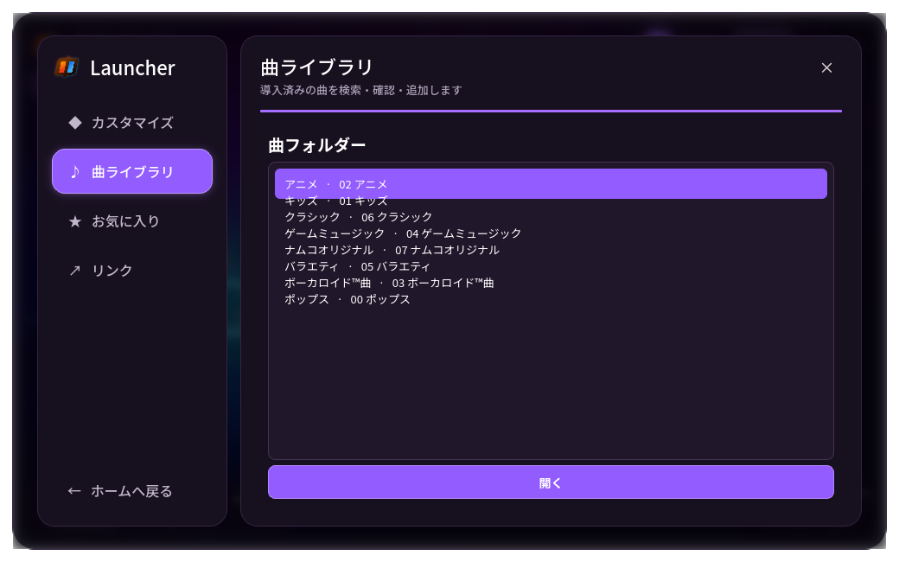

# TaikoNauts Launcher

TaikoNauts向けの非公式Windowsランチャーです。PySide6で構築した紫基調のUIを、CythonとPyInstallerで最適化した単一EXEとして配布しています。



## ダウンロード

[TaikoNautsLauncher-Portable.exe](dist/TaikoNautsLauncher-Portable.exe)

- Windows 10/11 x64
- 配布サイズ: 約30MB
- Pythonのインストール不要
- 初回起動後、設定から`TaikoNauts.exe`があるフォルダーを選択してください

署名していない個人ビルドのため、Windows SmartScreenが警告を表示する場合があります。

## 主な機能

- TaikoNautsの起動とインストール済みバージョン判定
- 宇宙背景と実ロゴを使用した紫基調のホーム画面
- 左から展開するサイドバーと、前面に重なる設定オーバーレイ
- 背景ブラー、ページ遷移、ホバー、選択状態のイージングアニメーション
- Noto Sans JPの同梱による日本語表示の統一
- スキン、曲、お気に入り、関連リンク、プレイヤーデータの管理
- フレームレス・角丸ウィンドウとWindows用マルチサイズアイコン


## ソースから実行

```powershell
py -m pip install PySide6 msgpack
py .\launcher_qt.pyw
```

## 単一EXEをビルド

必要なもの:

- Python 3.14 x64
- Visual Studio Build Toolsの「C++によるデスクトップ開発」

```powershell
py -m pip install -r .\requirements-build.txt
powershell -NoProfile -ExecutionPolicy Bypass -File .\build.ps1
```

生成物は`dist/TaikoNautsLauncher-Portable.exe`です。ビルドでは次を行います。

1. ランチャー本体をCythonでネイティブ拡張へ変換
2. `/O2`、LTCG、`/OPT:REF`、`/OPT:ICF`で最適化
3. 未使用のQt Quick、QML、PDF、Network、OpenGL、翻訳、プラグインを除外
4. PyInstaller one-fileへ画像、フォント、Windowsアイコンを格納

one-file版は実行時のみ必要なDLLを一時ディレクトリへ展開し、終了時に削除します。起動速度を最優先する場合はPyInstallerのone-folder構成へ変更してください。

## ファイル構成

```text
launcher_qt.pyw                  ランチャー本体
launcher_assets/                 背景、ロゴ、Noto Sans JP
build/                           Cython・アイコン生成用スクリプト
TaikoNautsLauncher-Portable.spec 最小構成のPyInstaller定義
build.ps1                        Windows向け再現ビルド
dist/                            配布用EXE
```

## クレジットと注意

デザイン構成は[Flarial Launcher](https://github.com/flarialmc/launcher)を参考にしています。本プロジェクトはTaikoNautsおよびFlarialの公式プロジェクトではありません。

同梱する第三者コンポーネントについては[THIRD_PARTY_NOTICES.md](THIRD_PARTY_NOTICES.md)を参照してください。背景・ロゴなどのプロジェクト固有アートワークには、別途明記されない限り再利用許諾を付与していません。

## ライセンス

本プロジェクトのオリジナルコードとアートワークはAll Rights Reservedです。公開されていること自体は、再利用・再配布・改変の許諾を意味しません。詳細は[LICENSE](LICENSE)と[ASSET_NOTICE.md](ASSET_NOTICE.md)を参照してください。

第三者コンポーネントには、それぞれのライセンスが優先して適用されます。
